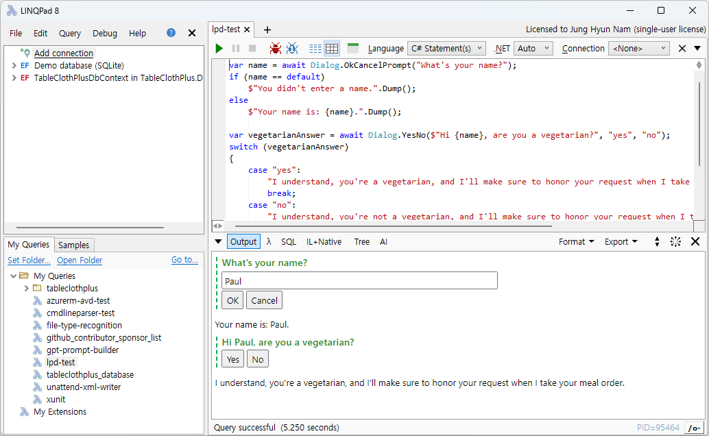
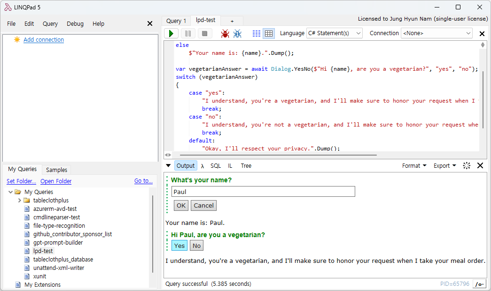

# LINQPadDialogs

 

A helper library that provides the ability to implement interactive user interfaces using LINQPad's built-in Controls.

LINQPad 8 | LINQPad 5
:--------:| :--------:
 | 

## Features

More features are on the way. Please give me lots of feedback and comments.

- Interactivity Features (Button Array)
- Interactivity Features (Prompt)

## Please read before continuing

- This NuGet package is supported by the generosity of community members. A small donation through GitHub Sponsorship will go a long way toward keeping the project running. ([Donate Now](https://github.com/sponsors/rkttu/))
- This library is intended to be used with LINQPad. It is not recommended for use in production development code.
- This package also requires a license of at least the Developer Edition of LINQPad to use it.
- If you write a script using the features provided by this package, it may not be possible to run it with the `lprun` CLI tool.

## For more information

Visit [https://github.com/rkttu/LINQPadDialogs](https://github.com/rkttu/LINQPadDialogs) repository.
